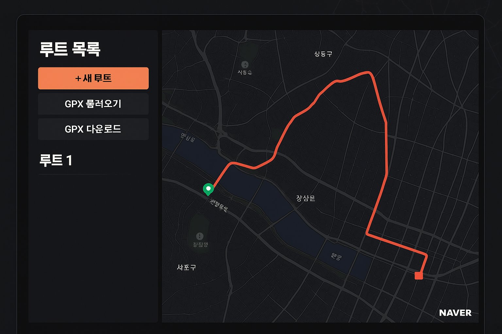

# fieldNote

네이버 지도 위에서 경로를 클릭으로 그리고, 여러 경로를 색상별로 관리하고, GPX 파일로 내보내기/가져오기하는 웹 도구.

기존 GPX 에디터(gpx.studio 등)가 전부 OSM 기반이라 한국 지도가 약한 빈 자리를 노린 프로젝트.

## 기술 스택

- **프레임워크:** Next.js (App Router), `output: 'export'` 정적 빌드
- **스타일링:** Tailwind CSS (다크 테마)
- **지도:** 네이버 지도 API v3 (NCP)
- **GPX:** 브라우저 DOMParser (파싱) + 수동 XML 생성 (내보내기)
- **상태 관리:** React Context + useReducer
- **테스트:** Vitest (43개 테스트)
- **배포:** Vercel 정적 배포 (main 푸시 → 자동 배포)

## 핵심 기능

- 네이버 지도 위에서 클릭으로 경로 그리기
- 여러 경로를 6색 팔레트로 색상별 구분 관리
- 웨이포인트 드래그 이동 / 우클릭·더블클릭 삭제
- 경로별 총 거리 표시 (Haversine 계산)
- GPX 파일 내보내기 / 가져오기 (고도·타임스탬프 보존)
- Ctrl+Z / Cmd+Z 실행취소 (좌표 매칭 기반)
- localStorage 자동 저장/복원 (디바운스 500ms, 스키마 검증)

## 프로젝트 구조

```
app/
  layout.tsx          — 전역 레이아웃 (다크 테마, ToastContext)
  page.tsx            — 메인 페이지 (사이드바 + 지도)
  globals.css         — Tailwind + 다크 테마 변수

components/
  NaverMap.tsx        — 네이버 지도 래퍼 (loading/ready/error 상태)
  RouteList.tsx       — 루트 목록
  RouteItem.tsx       — 개별 루트 항목 (이름, 거리, 색상, 삭제)
  Toolbar.tsx         — 상단 버튼 (+새 루트, GPX 불러오기/다운로드)
  Toast.tsx           — 슬라이드 인/아웃 토스트 알림

lib/
  RouteContext.tsx    — 루트 상태 관리 (Context + Reducer + localStorage)
  ToastContext.tsx    — 토스트 상태 관리
  geo.ts             — Haversine 거리 계산 (순수 함수)
  gpx.ts             — GPX 파싱/생성 유틸리티
  colors.ts          — 루트 색상 팔레트 (6색)

types/
  route.ts           — Route, Waypoint, AppState 타입 정의
```

## 실행 URL
https://field-note.vercel.app/


## 디자인

다크 모드 왼쪽 사이드바 레이아웃 (variant-B).


